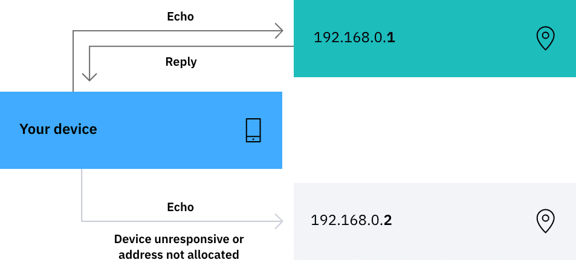
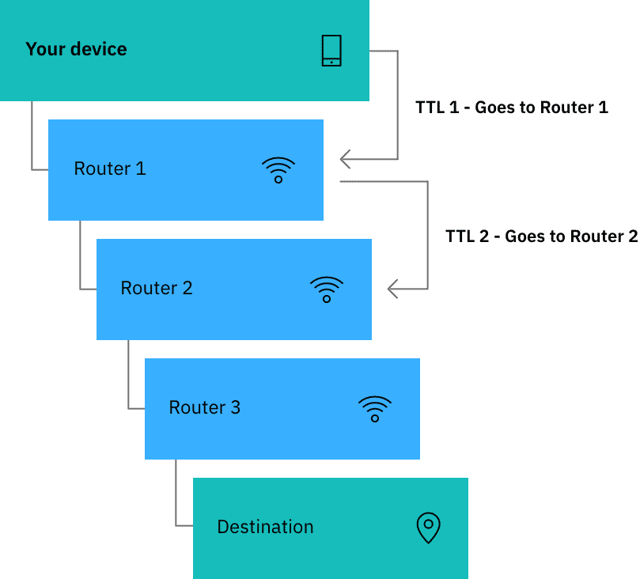

# 🔍 Open-Source Intelligence & Scanning (Day 03)

## 🌐 What is OSINT?
**Open-source intelligence (OSINT)** is intelligence gathered from **publicly available sources** like blogs, news sites, government databases, or social media.  
Attackers (and defenders) use OSINT to map targets and discover useful information.

---

## 📂 Sources of Open Information
- **🏢 Company Website** → May reveal contacts, building addresses, external profiles, or even overshared sensitive info.  
- **📰 Media & News** → Journalists often uncover details attackers can reuse.  
- **📱 Social Media** → People overshare (badges, diagrams, even sticky notes with passwords).  
- **🏛️ Government/Public Records** → Birth data, addresses, or corporate filings.  
- **💬 Forums & Boards** → Reddit, Quora, tech boards may reveal insider info.  
- **💼 Job Posts** → Reveal tools, systems, or technologies in use (potential attack vectors).  
- **🌍 DNS Records (WHOIS)** → Reveal ownership info, subdomains, and network infrastructure.  

⚡ **Information Aggregation**: combining small harmless details → a complete profile of someone’s life or organization.

---

## 🧪 Technical Scanning
Attackers and security professionals use technical scanning to assess network/system states.

### 📡 Ping Test
- Sends **ICMP echo request** to test if a device is online.  
- Helps debug networking issues & measure distance via **TTL (time-to-live)**.  
- Command:  
  ```bash
  ping target_name
  ```
- TTL decrement shows hops in a network path.



---

### 🛣️ Traceroute
- Maps devices between scanner ↔ target using TTL expirations.  
- Reveals routers & switches in the path.  
- Command (Windows):  
  ```bash
  tracert target_name
  ```



---

### 🔑 Port Scanning
- **Port = connection point** for services (like floors in a building).  
- **Open Port = open door** attackers may exploit.  
- TCP has **65,536 ports** →  
  - **80** = HTTP (web)  
  - **445** = Windows File Sharing (targeted by WannaCry ransomware)  
  - **3389** = Microsoft RDP (remote access risk)  

⚠️ Attackers look for open ports, defenders block/restrict them.

---

### 🛡️ Vulnerability Scanning
- Simulates attacks (like SQL injection) to find weaknesses.  
- **Version Detection** → Identifies software versions.  
- **OS Detection** → Reveals operating systems.  

---

### 🌎 Shodan Search Engine
> “The world’s first search engine for internet-connected devices.”

- Catalogs billions of scan results.  
- Used by **attackers** and **researchers**.  
- Can expose insecure IoT devices, webcams, or open services.

---

### 🌐 Network Scanning with Nmap
- **Nmap** = Network Mapper (CLI tool).  
- **Zenmap** = GUI for Nmap (beginner-friendly).  
- Can scan ports, OS, and services.  

```bash
nmap -A target_ip
```

---

### 🤖 AI in Technical Scanning
- ML algorithms improve scans:  
  - Categorize vulnerabilities  
  - Prioritize severity  
  - Learn from past scans → anticipate threats  
- Example: **IBM QRadar Advisor with Watson** → AI-driven incident analysis.

---

## 📚 Case Studies

### 🦠 Stuxnet
- 2010 → First advanced targeted malware.  
- Targeted **Iranian centrifuges** for nuclear enrichment.  
- Exploited **four zero-day vulnerabilities**.  
- Spread via **USB drives**, not internet.  
- Proved **air-gapped systems** can still be compromised.  

---

### 🏫 Los Angeles Unified School District (2022)
- Ransomware hit **1000 schools, 600k students**.  
- Attackers (Vice Society) leaked SSNs, health info, and credentials.  
- LAUSD refused ransom → data dumped on dark web.  
- ⚠️ Highlighted **ransomware risks in public institutions**.

---

### 🕵️‍♂️ Edward Snowden (2013)
- NSA subcontractor leaked classified docs via WikiLeaks.  
- Included **technical ops guidance** & sensitive materials.  
- Caused diplomatic fallout worldwide.  
- Example of a **malicious insider threat**.  

---

### 💸 Cash App (2022)
- Ex-employee stole data from **8 million users**.  
- Included account numbers, portfolios, and trading activity.  
- Breach undetected for **4 months**.  
- ⚠️ Shows importance of **revoking access immediately** after employee termination.

---

### 🌞 SolarWinds Supply Chain Attack (2020)
- Attackers compromised **SolarWinds Orion software updates**.  
- Malware spread to thousands of customers (gov & enterprises).  
- Rare but devastating **supply chain compromise**.  
- Reinforces **regular patching** and **vendor risk awareness**.  

---

## 📝 Key Points (Day 02 + Day 03)
1. 👥 **Threat Actors**: Script Kiddie, Hacktivist, Criminal Gang, Nation-State, Insider.  
2. 🎯 Attack types: DoS, Malware, MitM, DNS attacks.  
3. 🤖 AI enhances attack automation, evasion, targeting.  
4. 🔗 **Kill Chain (7 steps)** + **MITRE ATT&CK** = key attack frameworks.  
5. 💸 Crypto is favored by attackers (anonymous, hard to trace).  
6. 🛡️ Social engineering defense = Education, Process, Technology.  
7. 📧 Phishing signs: generic greetings, odd requests, suspicious links.  
8. 🌍 OSINT is cheap, powerful, and abundant.  
9. 🖥️ Technical scans (Ping, Traceroute, Port Scans, Nmap) reveal systems/networks.  
10. 📚 Case studies (Stuxnet, LAUSD, NSA, Cash App, SolarWinds) show real-world lessons.  

---
